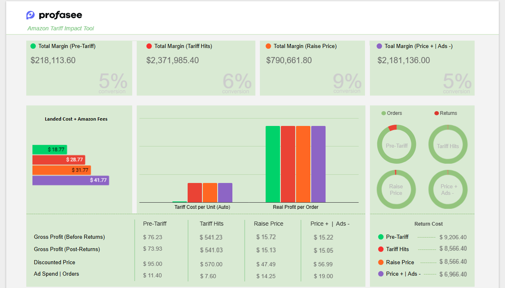

# New Tariff Impact Analyzer for Amazon Sellers (2025)

# Project Motivation & Overview
While scrolling through LinkedIn, I came across a post from Chad Rubin of Profasee, a well known voice in the Amazon sellers' community. He had just shared a spreadsheet tool he built — a straightforward but helpful Tariff Impact Analyzer designed to help Amazon sellers understand how the new and changing tariffs of 2025 were affecting their margins.

As someone who’s interest is about making data easier to understand, I was immediately drawn in. The workbook was truly business helpful and functional, but it presented its results mainly through rows of spreadsheet. I saw an opportunity to give the numbers flesh and improve usability.

That same day, Chad shared his workbook and I began working on it — not to change the logic or calculations, but to elevate the user experience through visuals. I introduced charts and dashboards that translated the outputs into clear narrative visuals. The goal was to make it easier for Amazon sellers using the analyzer to not only compute and see the impact of tariffs, but to see it — instantly and intuitively.

This project became a small but meaningful example of how data visualization can transform the way business owners interpret and act on information.

# Tools Used/Approach Used
* Google Sheets
* Looker Studio
* Data Storytelling/Visualization

# Results
The initial output of the analyzer was rows of spreadsheet, which wasn't very appealing. Used Google sheets to develop appropriate charts for all the calculations and output indicators

This dasbhoard is much clean and appear more helpful to help any Amazon seller to:
1. Quickly skim to specific parts of the analyzer
2. Make strategic decisions by 90% faster
3. Used for reporting purposes

[Link to the new workbook and dashboard](https://lookerstudio.google.com/reporting/b6857eea-2395-4c81-8817-304a932cec7d)

# Chanllenges & Solution
While formatting and arranging the charts, the tariff output indicators got max error.

Traced and recreacted the logic and formulas for each tariff indicators (Pre-Tariff, Tariff Hit, Raise Price, Raise Price + Less Ads)

# Conclusion
The Tariff Impact Analyzer by Chad provides a practical, lightweight solution for Amazon Sellers to understand balancing pricing and business profitability in the face of the 'trade wars and tariff hike' happening in 2025. Built entirely in Google Sheets, it empowers sellers to make quick, informed decisions without technical barriers. The combination of real time calculations and visual feedback makes it a valuable addition to any seller's toolkit, especially as global trade conditions continue to evolve.

By visualizing the outputs of the Amazon Tariff analyzer, I turned a functional spreadsheet into a decision support tool. Sellers can now not only run the numbers but also visually interpret how tariff changes affected their profitability — within seconds.

# References
* 
* 
